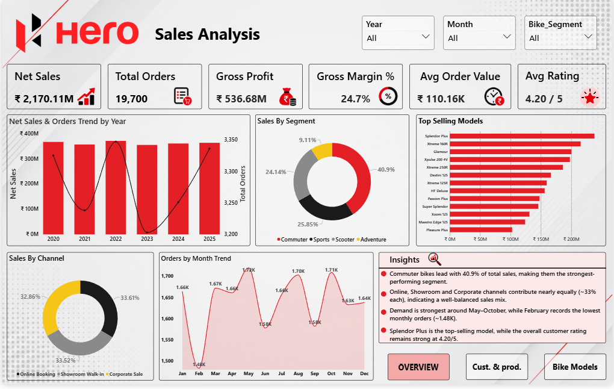
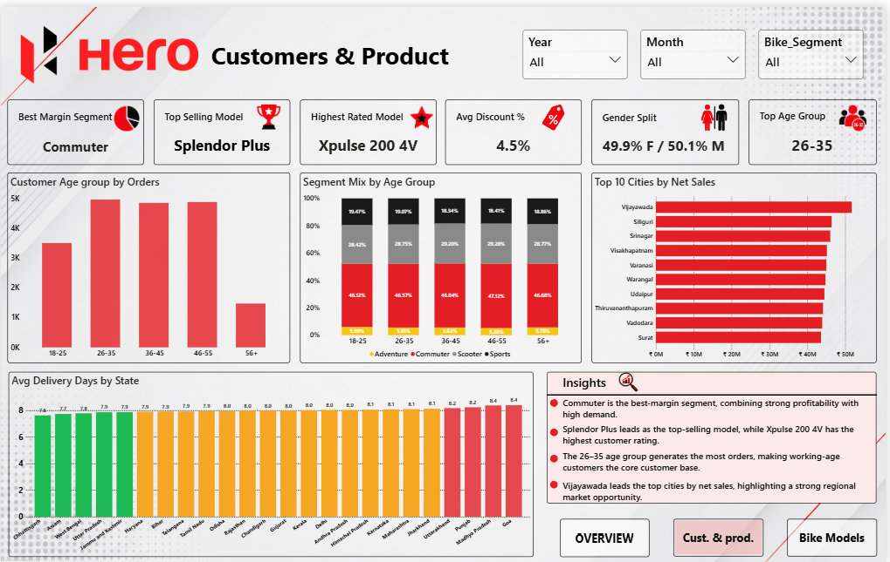
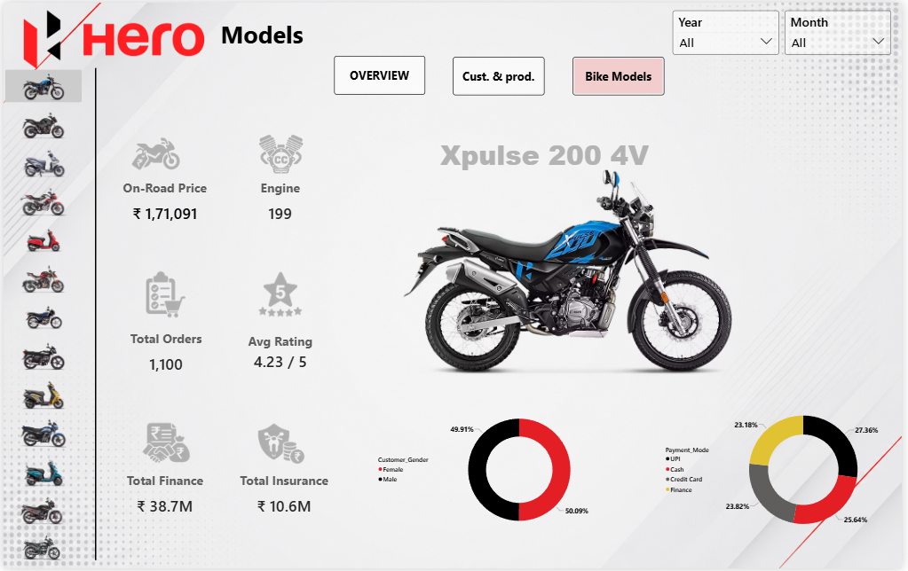

# 🏍️ Hero MotoCorp Sales Analysis Dashboard | Power BI

An interactive **3-page Power BI dashboard** built to analyze motorcycle sales performance, customer behavior, product performance, profitability, and individual bike model trends.

The project transforms raw motorcycle sales data into an interactive business intelligence solution using **Power BI, DAX, Power Query, and data visualization techniques**.

---

## 📊 Dashboard Preview

### 1️⃣ Sales Analysis — Overview

The Overview page provides a high-level view of overall business performance.

**Key KPIs:**

* Net Sales
* Total Orders
* Gross Profit
* Gross Margin %
* Average Order Value
* Average Customer Rating

**Analysis includes:**

* Year-wise Sales & Orders
* Sales by Bike Segment
* Top-Selling Models
* Sales by Channel
* Monthly Order Trends
* Business Insights



---

### 2️⃣ Customers & Product Analysis

This page focuses on customer demographics, product performance, and geographical trends.

**Key KPIs:**

* Best Margin Segment
* Top-Selling Model
* Highest Rated Model
* Average Discount
* Gender Split
* Top Customer Age Group

**Analysis includes:**

* Customer Age Group by Orders
* Segment Mix by Age Group
* Top 10 Cities by Net Sales
* Average Delivery Days by State
* Customer & Product Insights



---

### 3️⃣ Bike Model Analysis

The Bike Models page provides an interactive model-level analysis.

Users can select different motorcycle models from the left-side model selector and dynamically analyze their performance.

**Key metrics:**

* On-Road Price
* Engine Capacity
* Total Orders
* Average Rating
* Total Finance
* Total Insurance

**Analysis includes:**

* Monthly Net Sales, Cost & Gross Profit
* Customer Gender Distribution
* Payment Mode Distribution
* Individual Bike Model Performance



---

# 🎯 Project Objectives

The main objectives of this project were to:

* Analyze overall motorcycle sales performance.
* Identify top-performing bike segments and models.
* Understand customer demographics and purchasing behavior.
* Analyze sales trends across months and years.
* Evaluate profitability and gross margins.
* Identify high-performing cities and states.
* Analyze payment and financing behavior.
* Compare individual motorcycle models.
* Build an interactive dashboard for business decision-making.

---

# 💡 Key Business Insights

Some important insights identified through the dashboard include:

* **Commuter motorcycles contribute the largest share of overall sales.**
* **Splendor Plus is the top-selling motorcycle model.**
* The **26–35 age group generates the highest number of orders.**
* Online, showroom, and corporate sales channels have a **relatively balanced contribution**.
* Customer gender distribution is **almost evenly split**.
* **Xpulse 200 4V** has one of the strongest customer ratings among the analyzed models.
* The dashboard enables detailed comparison of individual motorcycle models across sales, ratings, finance, insurance, and payment behavior.

---

# 🛠️ Tools & Technologies

### Power BI

* Dashboard Development
* Data Visualization
* Interactive Filters & Slicers
* KPI Cards
* Page Navigation
* Interactive Model Analysis

### Power Query

* Data Cleaning
* Data Transformation
* Data Preparation
* Data Type Management

### DAX

* Calculated Measures
* KPI Calculations
* Aggregations
* Dynamic Dashboard Metrics

### Data Analysis

* Sales Analysis
* Customer Segmentation
* Product Analysis
* Profitability Analysis
* Trend Analysis

---

# 📐 Dashboard Structure

| Page                    | Purpose                                                  |
| ----------------------- | -------------------------------------------------------- |
| **Overview**            | Overall sales and business performance                   |
| **Customers & Product** | Customer demographics, product and geographical analysis |
| **Bike Models**         | Individual motorcycle model performance                  |

---

# 📂 Repository Structure

```text
Hero-MotoCorp-Sales-Analysis-PowerBI/
│
├── README.md
│
├── Hero_Sales_Analysis.pbix
│
├── dataset/
│   ├── Hero_All_Dataset.csv
│   └── Hero_bike_img.csv
│
└── images/
    ├── overview.png
    ├── customers_product.png
    └── bike_models.png
```

---

# 📁 Dataset

The project uses motorcycle sales and customer-related data containing information such as:

* Order details
* Order dates
* Motorcycle models
* Bike segments
* Sales channels
* Customer demographics
* Customer ratings
* Payment modes
* Finance
* Insurance
* Pricing
* Cost
* Gross Profit
* Geographic information
* Delivery information

The dataset was prepared and transformed before being used for dashboard development.

---

# 🎨 Dashboard Design

The dashboard follows a consistent **Hero-inspired red, black, white and light-gray visual theme**.

Design elements include:

* Consistent KPI cards
* Interactive slicers
* Red accent color
* Clean white/light-gray background
* Rounded visual containers
* Navigation buttons
* Model selection panel
* Business insight sections

The design focuses on making the dashboard both **visually appealing and business-focused**.

---

# 🔍 Interactivity

The dashboard includes interactive elements such as:

* Year slicer
* Month slicer
* Bike Segment slicer
* Bike Model selector
* Page navigation buttons
* Cross-filtering between visuals
* Dynamic KPI calculations

The Bike Models page dynamically updates based on the selected motorcycle model.

---

# 📈 Key KPIs

The dashboard tracks important business metrics including:

**Net Sales**

**Total Orders**

**Gross Profit**

**Gross Margin %**

**Average Order Value**

**Average Customer Rating**

**Average Discount**

**Total Finance**

**Total Insurance**

---

# 🚀 What I Learned

Through this project, I strengthened my practical knowledge of:

* Building multi-page Power BI dashboards
* Data cleaning using Power Query
* Creating DAX measures
* Designing interactive reports
* Creating KPI-driven dashboards
* Data storytelling
* Customer segmentation
* Sales and profitability analysis
* Business-oriented data visualization
* Converting raw data into actionable insights

---

# 📌 Project Highlights

✅ 3-page interactive Power BI dashboard
✅ Multiple business KPIs
✅ Interactive slicers and navigation
✅ Customer & product analysis
✅ Bike model-level analysis
✅ Sales and profitability analysis
✅ Geographic analysis
✅ Dynamic visual filtering
✅ DAX-based calculations
✅ Business insights

---

# 👨‍💻 Author

**Saransh Mathur**

B.Tech — Artificial Intelligence & Machine Learning

Interested in **Data Analytics, Business Intelligence, Power BI, SQL and Python**.

---

## ⭐ Project

If you found this project useful or interesting, feel free to explore the repository and connect with me.
